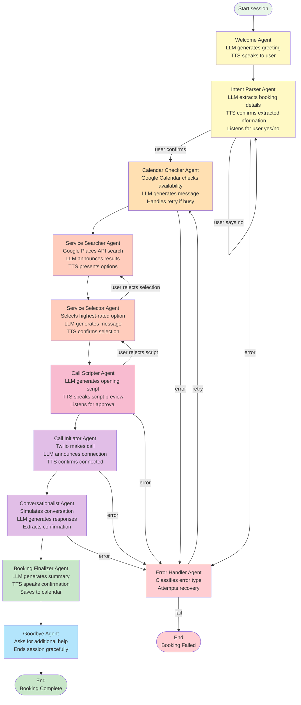

# HiyaDrive Agents - Complete Reference Guide

A comprehensive guide to all 9 voice agents in the HiyaDrive orchestration system.

---

## Agents Overview

HiyaDrive uses a **9-agent state machine** powered by LangGraph, where each agent handles one step of the booking workflow. Every agent is **voice-enabled** with dynamic message generation.



---

## Agent Details

### 1. Welcome Agent

**Purpose**: Generate a warm greeting and set conversational tone.

**What it does**:
- Generates unique greeting using Claude LLM
- Synthesizes greeting with ElevenLabs TTS
- Plays through speaker to greet driver
- Sets friendly, professional tone

**Input**: None (start of session)

**Output**: Greeting message spoken to user

**Example**:
```
System: "Hi there! I'm HiyaDrive, your voice booking assistant.
         What service can I help you book today?"
```

**Technology**:
- Claude LLM for dynamic greeting generation
- ElevenLabs TTS for natural voice synthesis
- Ensures zero hardcoded strings

**Next Agent**: Intent Parser Agent

---

### 2. Intent Parser Agent

**Purpose**: Extract booking details from user's spoken request.

**What it does**:
1. Listens to user's booking request
2. ElevenLabs STT transcribes speech to text
3. Claude LLM extracts structured intent:
   - Service type (haircut, dinner, appointment, etc.)
   - Party size (1-10 people)
   - Requested date/time
   - Location (optional)
4. Generates confirmation message
5. TTS speaks confirmation
6. Listens for user confirmation ("yes" or "no")

**Input**: User voice input

**Output**:
- Intent object with extracted details
- User confirmation (yes/no/restart)

**Example**:
```
User: "I want to book a table for 2 people at an Italian restaurant next Friday at 7 PM"

Extracted Intent:
{
    "service_type": "italian restaurant",
    "party_size": 2,
    "requested_time": "2024-11-22 19:00",
    "location": "current location"
}

System: "So you want to book a table for 2 people at an Italian restaurant
         next Friday at 7 PM. Is that correct?"

User: "Yes"
```

**Technology**:
- ElevenLabs STT for transcription
- Claude LLM for intent extraction with structured output
- Natural language processing with fallback for unclear requests

**Error Handling**:
- Transcription fails: Ask user to repeat
- Intent unclear: Ask clarifying questions
- User says "no": Restart from Welcome Agent

**Next Agent**: Calendar Checker Agent (if confirmed)

---

### 3. Calendar Checker Agent (Key Innovation)

**Purpose**: Check driver's calendar availability and handle conflicts intelligently.

**What it does**:
1. Checks Google Calendar for conflicts at requested time
2. If available: Announces availability and proceeds to Service Searcher
3. If busy (Key feature):
   - Asks driver for alternative time (up to 3 retries)
   - Example: "You're busy at that time. What time would work better?"
   - Listens for new time
   - Re-checks calendar with new time
   - Repeats until available slot found or max retries reached

**Input**:
- Requested time from Intent Parser
- Current session state

**Output**:
- Availability status (free/busy)
- Confirmed alternative time (if initially busy)

**Example Flow**:
```
Check 1: Friday 7 PM --> BUSY (already has dinner)

Ask: "You're busy at 7 PM. What time works better?"
User: "8 PM"

Check 2: Friday 8 PM --> FREE

Continue to Service Search
```

**Technology**:
- Google Calendar API v3 with service account auth
- RFC 3339 timestamp formatting
- Natural language date parsing with dateparser
- Timezone-aware datetime handling

**Configuration**:
- Max retry attempts: 3
- Max duration for booking: 120 minutes

**Key Features**:
- Handles natural language dates ("next Friday", "tomorrow at 3 PM")
- Fallback logic for ambiguous dates
- Graceful failure after max retries

**Error Handling**:
- Calendar API unavailable: Proceed with assumption driver is available
- Cannot parse new time: Ask for clarification
- Max retries reached: End booking with explanation

**Next Agent**: Service Searcher Agent (if available)

---

### 4. Service Searcher Agent

**Purpose**: Find matching services/businesses using Google Places API.

**What it does**:
1. Constructs search query from intent
   - Service type + location
   - Example: "Italian restaurant near current location"
2. Calls Google Places API
3. Receives list of businesses with ratings
4. Ranks by rating and distance
5. Generates announcement message
6. TTS announces results

**Input**:
- Service type from Intent
- Location (current or specified)

**Output**:
- Ranked list of top options
- Business details (name, rating, address, phone)

**Example**:
```
Search: "Haircut near San Francisco"

Results:
1. StyleCuts (4.8 stars, 0.2 km) - (415) 555-0101
2. Clips & Cuts (4.6 stars, 0.4 km) - (415) 555-0102
3. Hair Studio (4.4 stars, 0.5 km) - (415) 555-0103

System: "I found 3 salons near you. StyleCuts has the highest rating
         at 4.8 stars and is just a few blocks away."
```

**Technology**:
- Google Places API for business search
- Ranking algorithm (rating weighted more than distance)
- Claude LLM for announcement generation

**Features**:
- Works with any business type (restaurants, salons, doctors, services)
- Returns comprehensive business info
- Includes ratings and contact details

**Error Handling**:
- No results found: Ask to search wider area or try different service type
- API unavailable: Explain and offer manual booking alternative

**Next Agent**: Service Selector Agent

---

### 5. Service Selector Agent

**Purpose**: Let user choose or accept top service option.

**What it does**:
1. Presents top 3 options with details
   - Name, rating, distance, address
2. Asks driver for preference
   - "Would you like me to book StyleCuts, or would you prefer one of the others?"
3. Listens for response:
   - If preference stated: Select that option
   - If no preference: Select highest-rated (default)
4. Confirms selection with TTS
5. Generates call script

**Input**:
- List of services from Service Searcher
- User preference (if stated)

**Output**:
- Selected service object with all details

**Example**:
```
System: "I found these options:
         1. StyleCuts (4.8 stars) - nearest
         2. Clips & Cuts (4.6 stars)
         3. Hair Studio (4.4 stars)

         I'll book StyleCuts since it has the best rating.
         Does that work for you?"

User: "Yes" or "No, book the second one"
```

**Technology**:
- Claude LLM for response interpretation
- Ranking algorithm for default selection
- Natural language understanding for user preference

**Error Handling**:
- User preference unclear: Ask clarifying question
- User rejects all options: Go back to Service Searcher

**Next Agent**: Call Scripter Agent (if approved)

---

### 6. Call Scripter Agent

**Purpose**: Generate and preview the phone booking script.

**What it does**:
1. Generates natural conversation script using Claude LLM
2. Script includes:
   - Professional opening
   - Booking details (date, time, party size)
   - Polite closing
3. TTS speaks script preview
4. Listens for user approval
5. If approved: Passes script to Call Initiator
6. If rejected: Returns to Service Selector for different option

**Input**:
- Selected service details
- Booking details (time, date, party size)

**Output**:
- Conversation script
- User approval status

**Example**:
```
Generated Script:
"Hi, I'm calling to book an appointment.
 I'd like to schedule a haircut for 2 people
 on Friday, November 24th at 8 PM.
 Is that available?"

System: "I've prepared this script. Should I go ahead and call?"
User: "Yes, make the call"
```

**Technology**:
- Claude LLM for natural script generation
- Constrains to concise, professional tone
- Real-time STT for user approval

**Features**:
- Always asks for approval before calling
- Ensures driver knows what system will say
- Can reject and select different service

**Error Handling**:
- Script generation fails: Offer to proceed with simple request or try different service

**Next Agent**: Call Initiator Agent (if approved)

---

### 7. Call Initiator Agent

**Purpose**: Initiate phone call and confirm connection.

**What it does**:
1. Only executes if explicitly approved by user
2. Calls Twilio Programmable Voice API
3. Dials business phone number
4. Announces connection to driver
5. TTS says: "Calling [Business Name], connecting now..."
6. Passes call to Conversationalist Agent
7. Monitors call status

**Input**:
- Selected service with phone number
- Pre-generated script

**Output**:
- Call initiated
- Connection confirmation

**Example**:
```
System: "Calling StyleCuts at (415) 555-0101..."
System: "Connected to StyleCuts. Go ahead."
```

**Technology**:
- Twilio Programmable Voice API
- WebSocket streaming for audio
- Call status monitoring
- Error recovery if call drops

**Safety Feature**:
- Never calls without explicit user approval
- Always announces what it's doing
- Driver can hear conversation

**Error Handling**:
- Invalid phone number: Return to Service Selector
- Call fails to connect: Offer to retry or try different service
- Call drops: Attempt reconnection or offer manual fallback

**Next Agent**: Conversationalist Agent

---

### 8. Conversationalist Agent

**Purpose**: Simulate natural conversation with business and extract booking details.

**What it does**:
1. Receives two-way audio stream from Twilio
2. For each business response:
   - Transcribes using ElevenLabs STT
   - Sends to Claude LLM for response generation
   - Synthesizes response with ElevenLabs TTS
   - Sends audio back to business
3. Conversation continues until:
   - Business confirms availability
   - Business provides confirmation number
   - Booking is confirmed
4. Extracts confirmation details from conversation
5. Passes to Booking Finalizer

**Input**:
- Active Twilio call
- Pre-generated opening script
- Business response audio

**Output**:
- Confirmation number
- Booking details confirmed
- Full conversation transcript

**Example Flow**:
```
System: "Hi, I'm calling to book a haircut. I'd like
         to schedule 2 people on Friday at 8 PM."

Business (STT): "What time would work for you?"

System (LLM generates): "We'd like 8 PM on Friday."

Business (STT): "Perfect, we have 8 PM available.
                 Your confirmation number is HC-8247."

System (extraction): Confirmation HC-8247 confirmed
```

**Technology**:
- Twilio WebSocket for bidirectional audio
- ElevenLabs STT for transcription
- Claude LLM for response generation
- ElevenLabs TTS for synthesis
- NLP for confirmation extraction

**Features**:
- Truly conversational (not just a script)
- Handles unexpected responses
- Gracefully handles "sorry, we're full" scenarios
- Extracts essential booking info

**Error Handling**:
- Booking not available: Ask about alternative times
- Connection drops: Return to user with explanation and business contact info
- Cannot extract confirmation: Ask user to confirm details manually

**Next Agent**: Booking Finalizer Agent

---

### 9. Booking Finalizer Agent

**Purpose**: Confirm booking, save to calendar, and end session gracefully.

**What it does**:
1. Generates booking summary using Claude LLM
2. TTS speaks full booking confirmation:
   - Service provider name
   - Date and time
   - Confirmation number
   - What to bring/expect
3. Saves to Google Calendar:
   - Creates calendar event
   - Includes confirmation number in description
   - Sets as "busy" time
4. Passes to Goodbye Agent
5. Logs completion

**Input**:
- Confirmation details from Conversationalist
- Full booking state

**Output**:
- Spoken confirmation
- Calendar event created
- Completion logged

**Example**:
```
System: "Your booking is confirmed!

        Service: StyleCuts Haircut
        Date: Friday, November 24th
        Time: 8:00 PM
        Party Size: 2 people
        Confirmation: HC-8247

        I've saved this to your calendar.
        See you Friday at 8 PM!"

Calendar Event Created:
- Title: "Haircut at StyleCuts"
- Time: Friday 8 PM - 9 PM
- Location: StyleCuts salon address
- Notes: "Confirmation HC-8247"
```

**Technology**:
- Claude LLM for summary generation
- Google Calendar API for event creation
- RFC 3339 timestamp formatting
- Timezone handling

**Features**:
- Calendar event is immediately available
- Includes all booking details
- Professional, warm tone
- No system delays after confirmation

**Error Handling**:
- Calendar save fails: Inform user booking is confirmed, calendar will update when service is available

**Next Agent**: Goodbye Agent

---

### 10. Goodbye Agent

**Purpose**: End session gracefully and ask if additional help needed.

**What it does**:
1. Generates closing message
2. Asks: "Is there anything else I could help?"
3. Listens for user response:
   - If yes: Restart from Welcome Agent
   - If no: End session gracefully
4. Speaks final goodbye
5. Closes all connections
6. Logs session completion

**Input**:
- Booking completion status
- Session history

**Output**:
- Session ended
- All resources cleaned up

**Example**:
```
System: "Is there anything else I could help?"

User: "No, thank you"

System: "Great! Have a wonderful day. Safe travels!"

[Session ends, resources released]
```

**Technology**:
- Claude LLM for natural goodbye
- Session cleanup and resource management
- Logging of session metrics

**Features**:
- Always polite and professional
- Offers additional help
- Clean shutdown

**Error Handling**:
- User response unclear: Assume no and end session

**Next Agent**: None (session ends) or Welcome Agent (if user needs more help)

---

### Error Handler Agent

**Purpose**: Handle errors and determine if recovery is possible.

**What it does**:
1. Receives error from any agent
2. Classifies error type:
   - Temporary (network timeout) - retry operation
   - Service unavailable (API down) - fail and explain
   - User issue (invalid input) - ask for clarification
3. Generates user-friendly error message
4. TTS speaks explanation
5. Determines next action:
   - Retry the operation
   - Get user input for alternative
   - End session with graceful failure message

**Input**:
- Error object
- Current session state

**Output**:
- User-friendly error message
- Recovery action or session termination

**Example**:
```
Error: Google Places API returned empty results

Handler: "I couldn't find salons at that location.
          Would you like me to search a wider area,
          or try a different service type?"

User: "Try a wider area"

Action: Retry with broader search parameters
```

**Error Types & Handling**:
- Network timeout: Retry up to 2 times
- Service unavailable: End session, explain briefly
- Invalid input: Ask for clarification
- API authentication: End session, inform user of system issue

---

## Agent Interaction Pattern

All agents follow this pattern:

```
Input (from previous agent or user)
   |
   v
Process (extract info, call API, generate message)
   |
   v
Voice Output (TTS speaks result)
   |
   v
Voice Input (Listen for response if needed)
   |
   v
Output (pass to next agent)
```

---

## Agent Communication Flow

```
User speaks "hiya"
   |
   v
Welcome --> Intent Parser --> Calendar Checker
                                  |
                        Service Searcher --> Service Selector
                                                |
                                Call Scripter --> Call Initiator
                                                |
                                Conversationalist --> Booking Finalizer
                                                |
                                Goodbye Agent --> Session Ends

If user says "no" or error occurs: May loop back to earlier agent
```

---

## Key Design Principles

1. **Every Message is Spoken**: All agents use TTS
2. **User Confirmation**: Critical steps ask for approval
3. **Graceful Error Handling**: Simple, user-friendly error messages
4. **Service-Agnostic**: Works with any business type
5. **Conversational**: Natural language throughout
6. **Zero Hardcoded Strings**: Claude LLM generates all messages

---

## Performance Metrics per Agent

| Agent | Duration | Technology |
|-------|----------|-----------|
| Welcome | 2-3s | LLM + TTS |
| Intent Parser | 3-5s | STT + LLM |
| Calendar Checker | 1-2s | Google Calendar API |
| Service Searcher | 2-3s | Google Places API |
| Service Selector | 2-3s | LLM + User input |
| Call Scripter | 2-3s | LLM + TTS |
| Call Initiator | 2-5s | Twilio |
| Conversationalist | 30-60s | STT + LLM + TTS |
| Booking Finalizer | 3-5s | LLM + Calendar + TTS |
| Goodbye | 2-3s | LLM + TTS |
| **Total** | **50-90s** | Full booking |

---

## Security per Agent

- **Intent Parser**: Validates input before processing
- **Calendar Checker**: Uses read-only scope (Google Calendar)
- **Call Initiator**: Requires explicit user approval
- **Booking Finalizer**: Uses write scope only for confirmed bookings
- **All agents**: No PII logged to console

---

## Related Documentation

- [Voice Data Flow.md](Voice Data Flow.md) - Complete data pipeline
- [High-Level Architecture.md](High-Level Architecture.md) - System design
- [QUICKSTART.md](QUICKSTART.md) - User guide
- [README.md](README.md) - Project overview

---

**Version**: 2.0
**Last Updated**: November 2024
**Status**: Production-Ready
