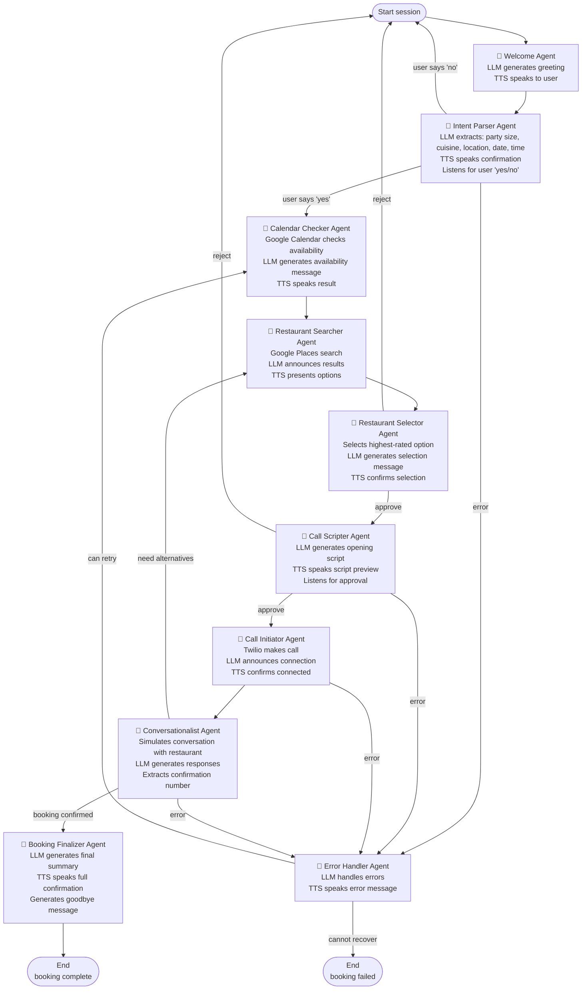

```mermaid

flowchart TD
    START(["Start session"])

    GREET["🎤 Welcome Agent\nLLM generates greeting\nTTS speaks to user"]

    A["🎤 Intent Parser Agent\nLLM extracts: party size, cuisine, location, date, time\nTTS speaks confirmation\nListens for user 'yes/no'"]

    B["🎤 Calendar Checker Agent\nGoogle Calendar checks availability\nLLM generates availability message\nTTS speaks result"]

    C["🎤 Restaurant Searcher Agent\nGoogle Places search\nLLM announces results\nTTS presents options"]

    D["🎤 Restaurant Selector Agent\nSelects highest-rated option\nLLM generates selection message\nTTS confirms selection"]

    E["🎤 Call Scripter Agent\nLLM generates opening script\nTTS speaks script preview\nListens for approval"]

    F["🎤 Call Initiator Agent\nTwilio makes call\nLLM announces connection\nTTS confirms connected"]

    G["🎤 Conversationalist Agent\nSimulates conversation with restaurant\nLLM generates responses\nExtracts confirmation number"]

    H["🎤 Booking Finalizer Agent\nLLM generates final summary\nTTS speaks full confirmation\nGenerates goodbye message"]

    ERR["🎤 Error Handler Agent\nLLM handles errors\nTTS speaks error message"]

    END_OK(["End\nbooking complete"])
    END_FAIL(["End\nbooking failed"])

    %% Interactive voice flow
    START --> GREET --> A

    A -->|user says 'yes'| B
    A -->|user says 'no'| START
    A -->|error| ERR

    B --> C
    C --> D

    D -->|approve| E
    D -->|reject| START

    E -->|approve| F
    E -->|reject| START
    E -->|error| ERR

    F --> G
    F -->|error| ERR

    G -->|booking confirmed| H --> END_OK
    G -->|need alternatives| C
    G -->|error| ERR

    %% Error handling
    ERR -->|can retry| B
    ERR -->|cannot recover| END_FAIL

```
