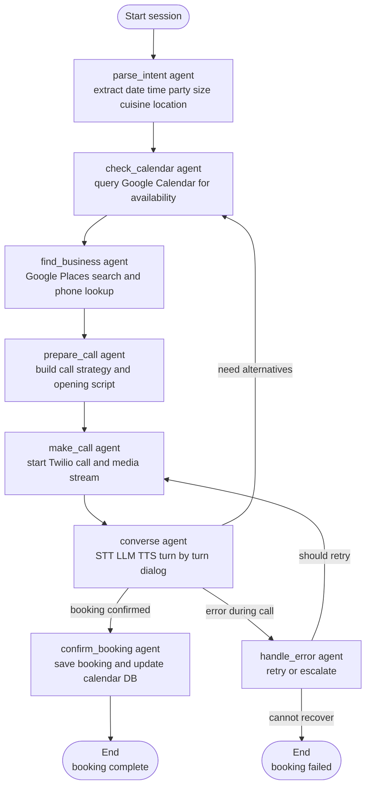

```mermaid

flowchart TD
    START(["Start session"])

    A["parse_intent agent\nextract date time party size cuisine location"]
    B["check_calendar agent\nquery Google Calendar for availability"]
    C["find_business agent\nGoogle Places search and phone lookup"]
    D["prepare_call agent\nbuild call strategy and opening script"]
    E["make_call agent\nstart Twilio call and media stream"]
    F["converse agent\nSTT LLM TTS turn by turn dialog"]
    G["confirm_booking agent\nsave booking and update calendar DB"]
    H["handle_error agent\nretry or escalate"]

    END_OK(["End\nbooking complete"])
    END_FAIL(["End\nbooking failed"])

    %% Main path
    START --> A --> B --> C --> D --> E --> F

    %% From converse, LangGraph conditional edges
    F -->|booking confirmed| G --> END_OK
    F -->|need alternatives| B
    F -->|error during call| H

    %% Error handling
    H -->|should retry| E
    H -->|cannot recover| END_FAIL

```
