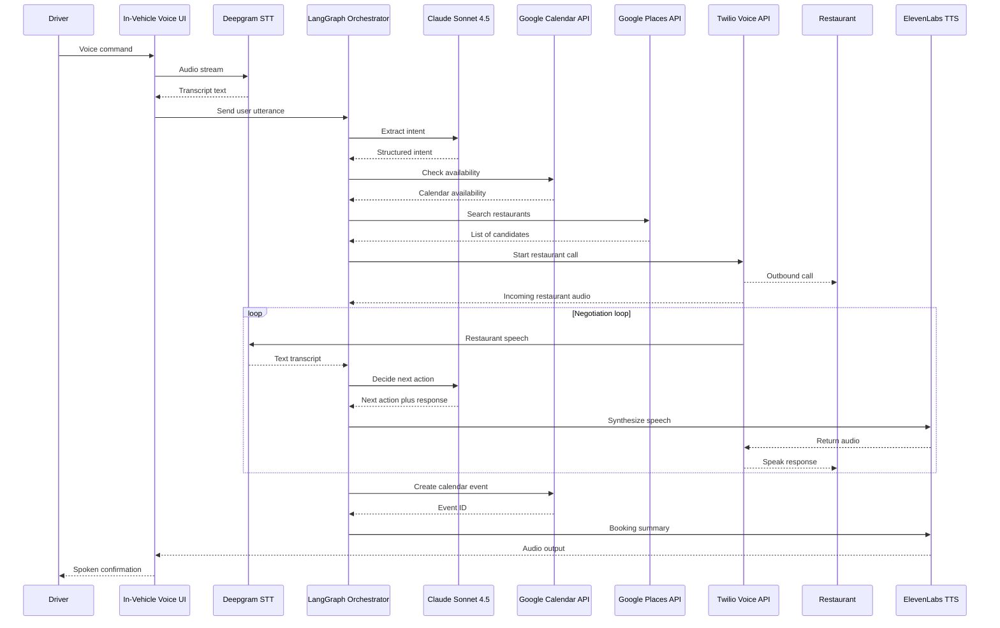

```mermaid
sequenceDiagram
    participant D as Driver
    participant V as In-Vehicle Voice UI
    participant STT as Deepgram STT
    participant ORCH as LangGraph Orchestrator
    participant LLM as Claude Sonnet 4.5
    participant CAL as Google Calendar API
    participant PLC as Google Places API
    participant TV as Twilio Voice API
    participant R as Restaurant
    participant TTS as ElevenLabs TTS

    D->>V: Voice command
    V->>STT: Audio stream
    STT-->>V: Transcript text
    V->>ORCH: Send user utterance

    ORCH->>LLM: Extract intent
    LLM-->>ORCH: Structured intent

    ORCH->>CAL: Check availability
    CAL-->>ORCH: Calendar availability

    ORCH->>PLC: Search restaurants
    PLC-->>ORCH: List of candidates

    ORCH->>TV: Start restaurant call
    TV-->>R: Outbound call
    TV-->>ORCH: Incoming restaurant audio

    loop Negotiation loop
        TV->>STT: Restaurant speech
        STT-->>ORCH: Text transcript
        ORCH->>LLM: Decide next action
        LLM-->>ORCH: Next action plus response
        ORCH->>TTS: Synthesize speech
        TTS-->>TV: Return audio
        TV-->>R: Speak response
    end

    ORCH->>CAL: Create calendar event
    CAL-->>ORCH: Event ID

    ORCH->>TTS: Booking summary
    TTS-->>V: Audio output
    V-->>D: Spoken confirmation

```
