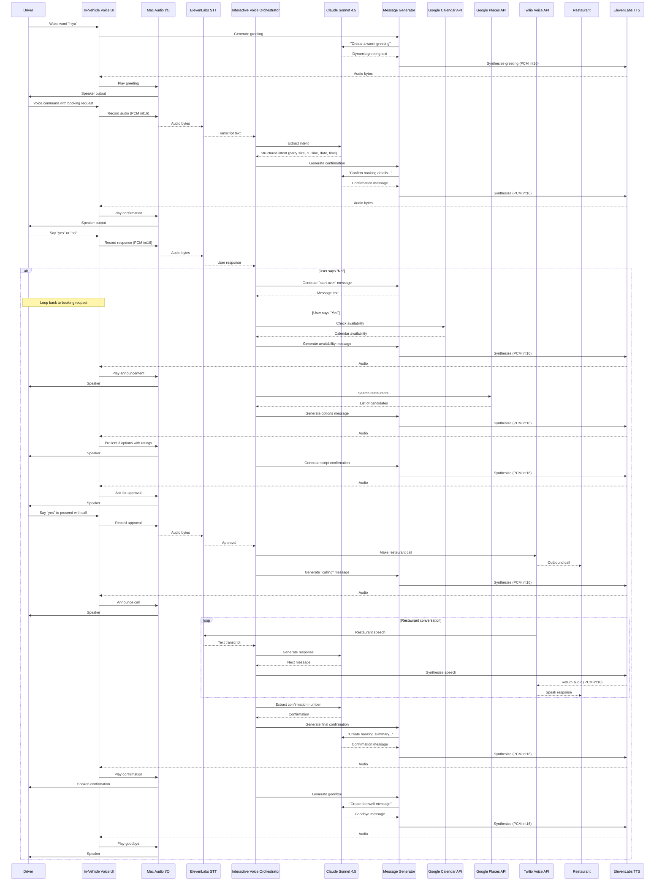

```mermaid
sequenceDiagram
    participant D as Driver
    participant V as In-Vehicle Voice UI
    participant AUDIO as Mac Audio I/O
    participant STT as ElevenLabs STT
    participant ORCH as Interactive Voice Orchestrator
    participant LLM as Claude Sonnet 4.5
    participant MSG as Message Generator
    participant CAL as Google Calendar API
    participant PLC as Google Places API
    participant TV as Twilio Voice API
    participant R as Restaurant
    participant TTS as ElevenLabs TTS

    D->>V: Wake word "hiya"
    V->>MSG: Generate greeting
    MSG->>LLM: "Create a warm greeting"
    LLM-->>MSG: Dynamic greeting text
    MSG->>TTS: Synthesize greeting (PCM int16)
    TTS-->>V: Audio bytes
    V->>AUDIO: Play greeting
    AUDIO->>D: Speaker output

    D->>V: Voice command with booking request
    V->>AUDIO: Record audio (PCM int16)
    AUDIO-->>STT: Audio bytes
    STT-->>ORCH: Transcript text

    ORCH->>LLM: Extract intent
    LLM-->>ORCH: Structured intent (party size, cuisine, date, time)

    ORCH->>MSG: Generate confirmation
    MSG->>LLM: "Confirm booking details..."
    LLM-->>MSG: Confirmation message
    MSG->>TTS: Synthesize (PCM int16)
    TTS-->>V: Audio bytes
    V->>AUDIO: Play confirmation
    AUDIO->>D: Speaker output

    D->>V: Say "yes" or "no"
    V->>AUDIO: Record response (PCM int16)
    AUDIO-->>STT: Audio bytes
    STT-->>ORCH: User response

    alt User says "No"
        ORCH->>MSG: Generate "start over" message
        MSG-->>ORCH: Message text
        Note over V,D: Loop back to booking request
    else User says "Yes"
        ORCH->>CAL: Check availability
        CAL-->>ORCH: Calendar availability
        ORCH->>MSG: Generate availability message
        MSG->>TTS: Synthesize (PCM int16)
        TTS-->>V: Audio
        V->>AUDIO: Play announcement
        AUDIO->>D: Speaker

        ORCH->>PLC: Search restaurants
        PLC-->>ORCH: List of candidates
        ORCH->>MSG: Generate options message
        MSG->>TTS: Synthesize (PCM int16)
        TTS-->>V: Audio
        V->>AUDIO: Present 3 options with ratings
        AUDIO->>D: Speaker

        ORCH->>MSG: Generate script confirmation
        MSG->>TTS: Synthesize (PCM int16)
        TTS-->>V: Audio
        V->>AUDIO: Ask for approval
        AUDIO->>D: Speaker

        D->>V: Say "yes" to proceed with call
        V->>AUDIO: Record approval
        AUDIO-->>STT: Audio bytes
        STT-->>ORCH: Approval

        ORCH->>TV: Make restaurant call
        TV-->>R: Outbound call

        ORCH->>MSG: Generate "calling" message
        MSG->>TTS: Synthesize (PCM int16)
        TTS-->>V: Audio
        V->>AUDIO: Announce call
        AUDIO->>D: Speaker

        loop Restaurant conversation
            TV->>STT: Restaurant speech
            STT-->>ORCH: Text transcript
            ORCH->>LLM: Generate response
            LLM-->>ORCH: Next message
            ORCH->>TTS: Synthesize speech
            TTS-->>TV: Return audio (PCM int16)
            TV-->>R: Speak response
        end

        ORCH->>LLM: Extract confirmation number
        LLM-->>ORCH: Confirmation #

        ORCH->>MSG: Generate final confirmation
        MSG->>LLM: "Create booking summary..."
        LLM-->>MSG: Confirmation message
        MSG->>TTS: Synthesize (PCM int16)
        TTS-->>V: Audio
        V->>AUDIO: Play confirmation
        AUDIO->>D: Spoken confirmation

        ORCH->>MSG: Generate goodbye
        MSG->>LLM: "Create farewell message"
        LLM-->>MSG: Goodbye message
        MSG->>TTS: Synthesize (PCM int16)
        TTS-->>V: Audio
        V->>AUDIO: Play goodbye
        AUDIO->>D: Speaker
    end

```
