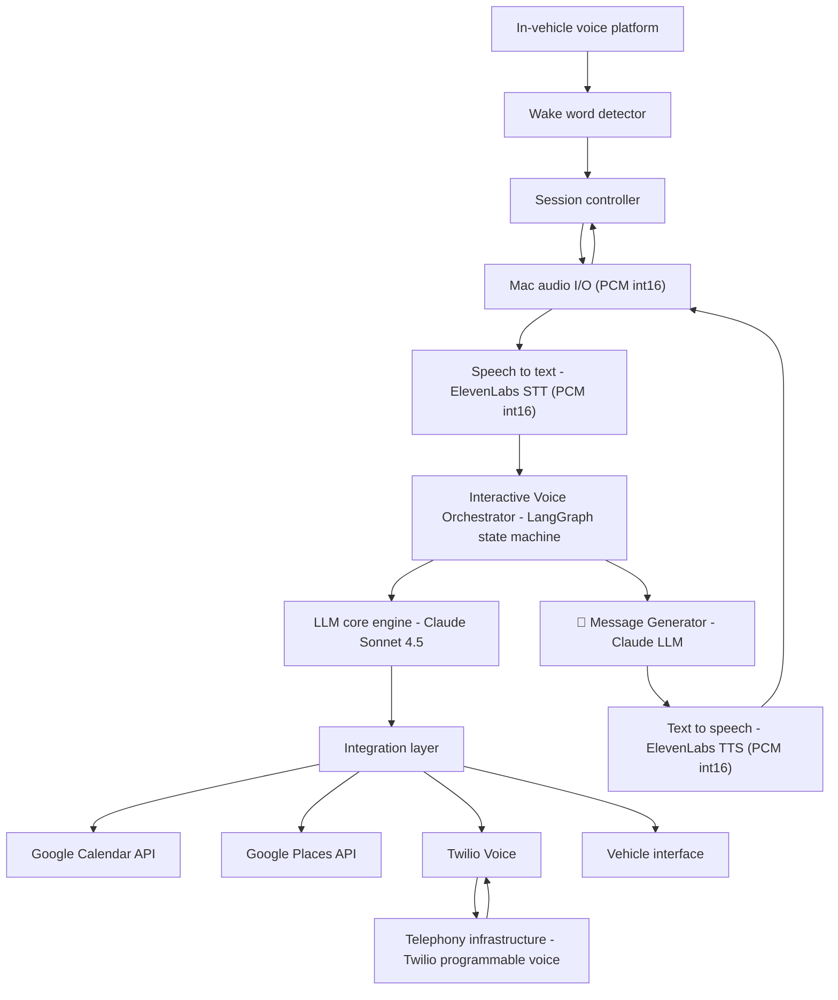

```mermaid
flowchart TD
    V["In-vehicle voice platform"]
    W["Wake word detector"]
    S["Session controller"]

    O["Interactive Voice Orchestrator - LangGraph state machine"]
    LLM["LLM core engine - Claude Sonnet 4.5"]
    MSG["🎤 Message Generator - Claude LLM"]
    INTEG["Integration layer"]
    CAL["Google Calendar API"]
    PLACE["Google Places API"]
    TWV["Twilio Voice"]
    VEH["Vehicle interface"]

    STT["Speech to text - ElevenLabs STT (PCM int16)"]
    TTS["Text to speech - ElevenLabs TTS (PCM int16)"]
    AUDIO["Mac audio I/O (PCM int16)"]
    TEL["Telephony infrastructure - Twilio programmable voice"]

    %% Voice path
    V --> W --> S
    S --> AUDIO --> STT --> O
    O --> LLM
    O --> MSG
    LLM --> INTEG
    MSG --> TTS
    INTEG --> CAL
    INTEG --> PLACE
    INTEG --> TWV
    INTEG --> VEH

    TTS --> AUDIO --> S
    TWV --> TEL
    TEL --> TWV

```
