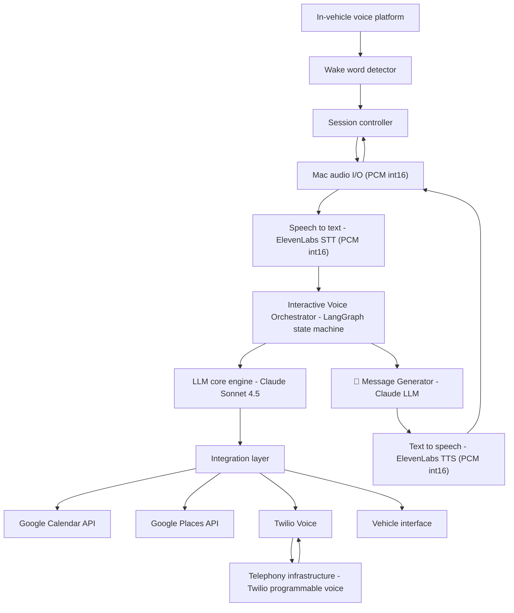

# HiyaDrive - High-Level Architecture

An AI-powered voice booking agent for drivers that enables hands-free booking of any service - restaurants, salons, appointments, and more. This document describes the complete system architecture.

---

## 🎯 System Overview



---

## 📊 Architecture Layers

### 1. Voice I/O Layer

**Purpose**: Capture and synthesize voice signals with high quality and low latency.

**Components**:
- **Mac Audio I/O** (`hiya_drive/voice/audio_io.py`)
  - Captures microphone input as PCM int16 (16-bit signed, 16 kHz, mono)
  - Plays speaker output as PCM int16
  - Handles audio buffering and async I/O
  - Cross-platform compatibility (optimized for macOS)

- **Speech-to-Text (ElevenLabs STT)**
  - Transcribes voice to text in 300-500ms
  - Optimized for telephony and in-car noise
  - Streaming support for real-time transcription
  - Custom vocabulary support for business names

- **Text-to-Speech (ElevenLabs TTS)**
  - Synthesizes text with natural prosody in 300-500ms
  - Streaming output (word-by-word) for fast playback
  - Multiple voice options (e.g., Sarah)
  - Emotional range for conversational tone

**Technology Choices**:
- ElevenLabs chosen over alternatives (Whisper, Azure TTS) for:
  - Low latency critical for voice interaction
  - Telephony-grade audio quality
  - Streaming support to reduce wait times
  - Natural-sounding voice synthesis

### 2. Orchestration Layer

**Purpose**: Manage the multi-step booking workflow and coordinate between user input, LLM, and integrations.

**Core Component**: `hiya_drive/core/interactive_voice_orchestrator.py`

**Orchestrator Type**: LangGraph State Machine (9-node workflow)

**Nodes**:
1. **Welcome Agent** 🎤 - LLM-generated greeting
2. **Intent Parser Agent** 🎤 - Confirms parsed booking details
3. **Calendar Checker Agent** 🎤 - Checks driver availability (with retry on conflict)
4. **Service Searcher Agent** 🎤 - Searches for matching businesses
5. **Service Selector Agent** 🎤 - Presents top 3 options with ratings
6. **Call Scripter Agent** 🎤 - Generates conversation script
7. **Call Initiator Agent** 🎤 - Initiates phone call (only if approved)
8. **Conversationalist Agent** 🎤 - Simulates booking conversation
9. **Booking Finalizer Agent** 🎤 - Confirms booking and saves to calendar

**State Management**:
- Uses `BookingState` dataclass (defined in `hiya_drive/models/state.py`)
- Tracks session status, user choices, calendar availability, found services
- Supports conditional routing based on user responses

**Key Feature: Calendar Retry Logic**
```
If driver unavailable:
  ├─ Ask for alternative time (up to 3 attempts)
  ├─ Extract new time from user response
  ├─ Re-check calendar
  └─ Continue if available, or graceful failure
```

**Flow Control**:
- Steps 3-8 only execute after calendar confirmation
- Early exit on fatal errors (API failures)
- Graceful degradation for missing features

### 3. LLM Intelligence Layer

**Purpose**: Generate dynamic messages, parse user intent, and conduct natural conversations.

**Components**:

**a) Core LLM: Claude Sonnet 4.5**
- Fast tool-calling with low latency (<500ms)
- Long context window for conversation history
- Reliable instruction following
- Cost-effective for frequent API calls

**Capabilities**:
- Intent parsing (extract service type, date, time, party size)
- Dynamic message generation (zero hardcoded strings)
- Conversation simulation with business representatives
- Confirmation number extraction

**b) Message Generator** (`hiya_drive/voice/llm_message_generator.py`)
- Generates all user-facing messages dynamically
- System prompts for each stage of booking
- Customizable tone (friendly, professional, concise)
- Enforces length constraints (<15 seconds, <30 words)

**Usage**:
```python
# Generate greeting
greeting = await message_generator.generate_greeting()

# Generate confirmation
confirmation = await message_generator.generate_confirmation(intent)

# Extract intent from user speech
intent = await message_generator.extract_intent_from_response(transcript)
```

### 4. Integration Layer

**Purpose**: Connect to external services for calendar checking, business search, and phone calls.

**Integrations**:

**a) Google Calendar API** (`hiya_drive/integrations/calendar_service.py`)
- **Check Availability**: Query calendar for free slots
- **Create Events**: Save confirmed appointments
- **Error Handling**:
  - Handles timezone-aware datetimes (RFC 3339 format)
  - Parses natural language dates ("next Friday at 7 PM")
  - Retries on transient failures

**Key Features**:
- Uses service account authentication
- Supports shared calendars
- Intelligent date parsing with fallback logic

**b) Google Places API** (`hiya_drive/integrations/places_service.py`)
- **Search**: Find businesses by type and location
- **Details**: Retrieve phone numbers, hours, ratings
- **Generic Search**: Works with any business type

**Query Format**:
```python
# Search for service type near location
results = places_service.search(
    query=f"{cuisine_type} {service_type}",
    location="current_location"
)
```

**c) Twilio Voice API** (`hiya_drive/integrations/twilio_service.py`)
- **Outbound Calls**: Initiate phone calls to businesses
- **WebSocket Streaming**: Real-time audio during calls
- **Call Simulation**: Route conversation through LLM

**d) Vehicle Interface** (Optional)
- Speed and road condition data
- Safe-to-prompt notifications (defer messages during complex driving)
- Not currently implemented, but architecture supports it

### 5. Session Management Layer

**Purpose**: Control wake word detection, user listening, and session lifecycle.

**Components**:
- **Wake Word Detector** (`hiya_drive/voice/wake_word_detector.py`)
  - Detects "hiya" to activate system
  - Continuous listening when idle

- **Session Controller** (in `main.py`)
  - Manages session lifecycle (start, active, end)
  - Coordinates between voice input/output
  - Handles timeouts and error recovery

---

## 🔄 Complete Data Flow

### Step-by-Step Booking Flow

```
1. ACTIVATION
   Driver says "hiya" (wake word)
   └─> Wake Word Detector triggers session

2. GREETING
   Session Controller → Message Generator
   └─> Generate greeting text (Claude LLM)
   └─> ElevenLabs TTS synthesizes
   └─> Play through speaker

3. USER REQUEST
   Driver says booking request
   └─> Audio → ElevenLabs STT
   └─> Transcript sent to Orchestrator

4. INTENT PARSING
   Orchestrator → Claude LLM
   └─> Extract: service type, party size, date, time
   └─> Message Generator creates confirmation
   └─> Driver confirms or denies

5. CALENDAR CHECKING ✨
   Orchestrator → Google Calendar API
   ├─ If available → Continue
   └─ If busy:
      ├─ Ask for alternative time
      ├─ Re-check (up to 3 attempts)
      └─ Continue if available

6. SERVICE SEARCH
   Orchestrator → Google Places API
   └─> Search for matching businesses
   └─> Rank by rating and distance
   └─> Present top 3 options

7. SELECTION
   Driver chooses option or accepts top pick
   └─> Message Generator creates call script

8. PHONE CALL
   Orchestrator → Twilio Voice
   └─> Initiate outbound call to business
   └─> Stream conversation through LLM
   └─> LLM extracts confirmation number

9. CONFIRMATION & SAVING
   Booking details collected
   ├─> Message Generator creates summary
   ├─> ElevenLabs TTS speaks confirmation
   ├─> Google Calendar API saves event
   └─> Ask "Is there anything else I could help?"

10. SESSION END
    Driver satisfied or declines
    └─> Session terminates
```

---

## 🛡️ Error Handling Strategy

### Error Categories

**Fatal Errors** (End Session):
- API authentication failures
- Network connectivity loss
- Invalid API keys
- Service unavailable (3+ retries)

**Retryable Errors** (Calendar Specific):
- Driver is busy at requested time
- Solution: Ask for alternative time (up to 3 attempts)

**Graceful Degradation**:
- Missing optional features don't block booking
- Send SMS reminder if TTS fails
- Manual callback if Twilio fails

### Error Recovery Pattern

```python
try:
    # Attempt operation
except RetryableError as e:
    if retries < max_retries:
        # Ask for user input / alternative
        retries += 1
        continue
    else:
        # Graceful failure
        handle_graceful_failure()
except FatalError as e:
    # End session immediately
    state.status = SessionStatus.FAILED
    report_error()
```

---

## 🔐 Security & Privacy

**API Key Management**:
- All keys stored in `.env` file
- Never logged or exposed in error messages
- Service account credentials in separate `credentials.json`

**PII Protection**:
- Calendar data read-only when possible
- Minimal PII sharing with third parties
- Secure TLS connections for all API calls

**Hands-Free Compliance**:
- No screen interaction required
- Voice-only input/output
- Audio confirmation of actions

---

## 📈 Performance Characteristics

| Component | Latency | Throughput |
|-----------|---------|-----------|
| Wake word detection | 2-3s per chunk | N/A |
| ElevenLabs STT | 300-500ms | Real-time streaming |
| Intent parsing (Claude) | 200-400ms | N/A |
| Google Calendar check | 500-1000ms | N/A |
| Google Places search | 1-2s | N/A |
| Twilio call setup | 2-5s | N/A |
| **End-to-End (E2E)** | **10-15 seconds** | **1 user per instance** |

**Optimization Strategies**:
- Streaming audio for faster playback
- Parallel API calls where possible
- Caching of frequently accessed data
- Short message constraints to reduce TTS time

---

## 🏗️ Technology Stack Justification

| Layer | Technology | Choice | Rationale |
|-------|-----------|--------|-----------|
| **Voice I/O** | ElevenLabs | STT + TTS | Low latency + natural quality |
| **Orchestration** | LangGraph | State machine | Multi-step workflows with branching |
| **LLM** | Claude Sonnet 4.5 | Tool-calling | Fast, reliable, long context |
| **Calendar** | Google Calendar | API v3 | Standard, reliable, full-featured |
| **Search** | Google Places | API v3 | Comprehensive business data |
| **Telephony** | Twilio | Programmable Voice | WebSocket streaming, flexible |
| **Language** | Python 3.9+ | Async/await | Clean async code, rich libraries |

---

## 📂 Key File Structure

```
hiya_drive/
├── core/
│   └── interactive_voice_orchestrator.py      # Main orchestration (9-node LangGraph)
├── voice/
│   ├── audio_io.py                            # Mac audio I/O (PCM int16)
│   ├── voice_processor.py                     # STT/TTS coordination
│   ├── llm_message_generator.py               # Dynamic message generation
│   └── wake_word_detector.py                  # "hiya" detection
├── integrations/
│   ├── calendar_service.py                    # Google Calendar API
│   ├── places_service.py                      # Google Places API
│   └── twilio_service.py                      # Twilio Voice API
├── models/
│   └── state.py                               # State definitions
├── config/
│   └── settings.py                            # Environment configuration
└── main.py                                    # CLI entry point
```

---

## 🚀 Future Enhancements

1. **Vehicle Context Integration**
   - Use CarPlay/Android Auto APIs for driving conditions
   - Defer non-urgent prompts during complex driving
   - Speed-aware response timing

2. **Multi-Service Concierge**
   - Extend beyond voice bookings to gas, parking, maintenance
   - Proactive suggestions based on calendar and location
   - Multi-step service orchestration

3. **Advanced NLU**
   - Entity linking for service types
   - Slot filling for missing information
   - Context carryover between sessions

4. **Language Support**
   - Multilingual intent parsing
   - Multilingual TTS output
   - Localized business search

5. **Evaluation Metrics**
   - Task completion rate (target >85%)
   - Driver distraction (NASA-TLX <3/10)
   - Reaction time preservation
   - Prompt length enforcement

---

## 🤝 Integration Points for Developers

**Adding a New Service**:
```python
# 1. Create service wrapper in integrations/
class NewService:
    async def perform_action(self, params):
        pass

# 2. Add to orchestrator nodes
async def new_service_node(state):
    result = await new_service.perform_action(...)
    state.results.append(result)
    return state

# 3. Wire into LangGraph
builder.add_node("new_service_step", new_service_node)
builder.add_edge("previous_step", "new_service_step")
```

**Custom Message Generation**:
```python
# Override message generator for domain-specific language
class CustomMessageGenerator(LLMMessageGenerator):
    async def generate_confirmation(self, intent):
        # Domain-specific confirmation logic
        pass
```

---

## 📝 Summary

HiyaDrive's architecture enables **production-grade voice bookings** by combining:

✅ **Low-latency voice I/O** with ElevenLabs STT/TTS
✅ **Intelligent orchestration** with LangGraph state machines
✅ **Dynamic conversation** with Claude LLM
✅ **Calendar awareness** with retry logic for conflicts
✅ **Multiple integrations** for universal service booking
✅ **Robust error handling** with graceful degradation

The system is **service-agnostic** - works with restaurants, salons, doctors, services, and any phone-callable business. All messages are generated by Claude LLM, ensuring **zero hardcoded strings** and **truly conversational** interactions.

---

**Architecture Version**: 2.0
**Last Updated**: November 2024
**Status**: Production-Ready
