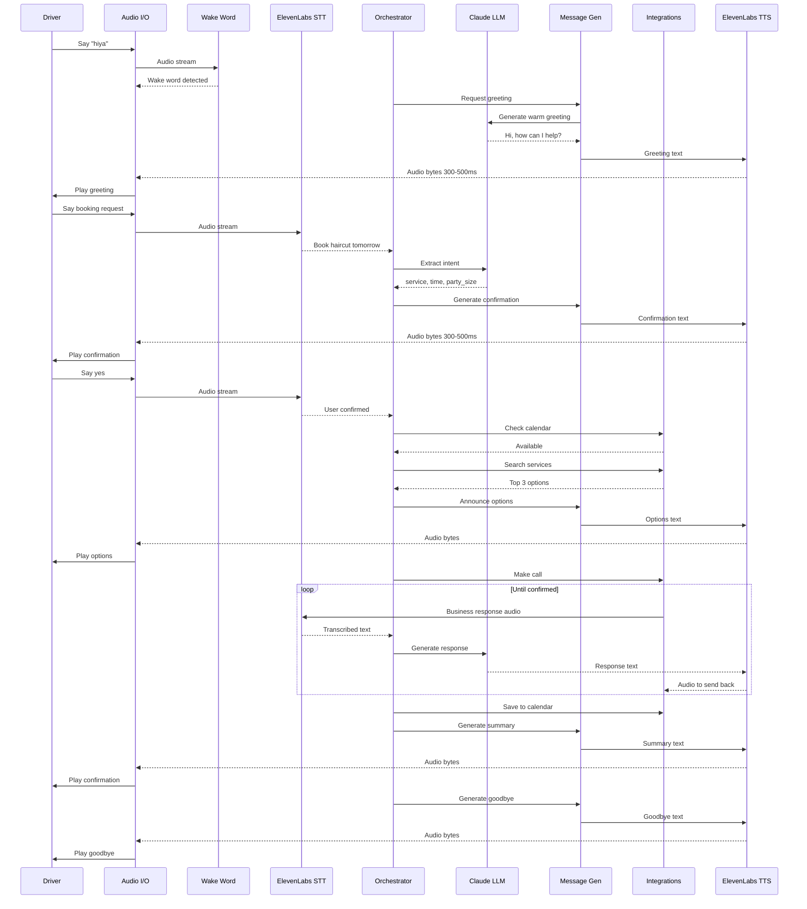
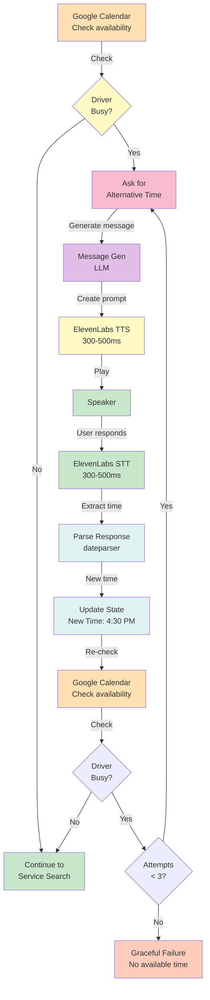

# Voice Data Flow - Complete Pipeline Reference

A comprehensive visual guide to how voice data flows through HiyaDrive.

---

## Quick Navigation

- [Overview & Quick Reference](#overview)
- [Complete End-to-End Flow](#complete-end-to-end-flow)
- [Layer-by-Layer Breakdown](#layer-by-layer-breakdown)
- [Audio Format Specifications](#audio-format-specifications)
- [Processing Stages](#processing-stages)
- [Error Handling](#error-handling)
- [Performance Metrics](#performance-metrics)

---

## Overview

This diagram shows the **complete journey of voice** through the HiyaDrive system:

```mermaid
graph LR
    USER["User speaks"]
    CAPTURE["Audio Capture"]
    WW["Wake Word\nDetection"]
    STT["Speech-to-Text\nElevenLabs STT"]
    PROCESS["Processing\nOrchestrator"]
    LLM["Intelligence\nClaude LLM"]
    GENERATE["Message Gen\nDynamic Text"]
    TTS["Text-to-Speech\nElevenLabs TTS"]
    PLAY["Play Audio"]

    USER -->|PCM int16,\n16kHz, mono| CAPTURE
    CAPTURE -->|Audio chunks\n4096 bytes| WW
    WW -->|Wake word\ndetected| STT
    STT -->|Transcript\n300-500ms| PROCESS
    PROCESS -->|Request| LLM
    PROCESS -->|Intent + Context| GENERATE
    LLM -->|Response| GENERATE
    GENERATE -->|Text message\nservice-agnostic| TTS
    TTS -->|Audio bytes\n300-500ms| PLAY
    PLAY -->|Speaker output| USER

    style USER fill:#b3e5fc
    style CAPTURE fill:#e0f2f1
    style WW fill:#fff9c4
    style STT fill:#c8e6c9
    style PROCESS fill:#ffccbc
    style LLM fill:#f8bbd0
    style GENERATE fill:#e1bee7
    style TTS fill:#fff9c4
    style PLAY fill:#c8e6c9
```



---

## Audio Format Specifications

**Standard format used throughout HiyaDrive**:

```
PCM int16 (Pulse Code Modulation)
----
Bit Depth:      16-bit signed integer
Sample Rate:    16,000 Hz (16 kHz)
Channels:       1 (Mono)
Byte Order:     Little-endian
Chunk Size:     4,096 bytes (typical)
Duration/Chunk: 256 ms of audio per chunk
Latency:        Less than 100ms per chunk
Bit Rate:       32 KB/second
----
```

**Why PCM int16?**
- Optimal for human speech (4-8 kHz fundamental, harmonics to 16 kHz)
- Standard telephony format
- Low latency processing
- Minimal bandwidth
- High quality for LLM processing

---

## Complete End-to-End Flow

### Full Journey from User to Response



---

## Layer-by-Layer Breakdown

### Layer 1: Voice Input Pipeline

```
User speaks (microphone input)
   |
   v
PCM int16 audio at 16 kHz
   | [4096 byte chunks]
   v
Audio buffering and management
   | [Continuous listening]
   v
Wake word detector detects "hiya"
   | [Wake word detected]
   v
ElevenLabs STT processes audio
   | [300-500ms latency]
   v
Transcript text (user utterance)
```

**Key Components**:
- Audio I/O: Manages microphone input with buffering
- Wake Word Detector: Continuous listening for "hiya"
- STT Service: ElevenLabs API for speech-to-text with streaming
- Stream Processing: Non-blocking async audio handling

---

### Layer 2: Processing Pipeline

```
Transcript text
   |
   v
Orchestrator (LangGraph)
   | [Route to appropriate agent]
   v
Claude LLM (Intent extraction)
   | [Extract parameters]
   v
Intent object with structured data
   |
   v
BookingState (In-memory state machine)
```

**Intent Extraction Example**:
```
Input:  "Book a haircut for 2 people tomorrow at 3 PM"

Output:
{
    "service_type": "haircut",
    "party_size": 2,
    "requested_time": "2024-11-14 15:00",
    "location": "current_location"
}
```

---

### Layer 3: Message Generation Pipeline

```
Current state (booking parameters)
   | [Provide context]
   v
Message template (system prompt)
   | [Send request]
   v
Claude LLM (generate message)
   | [Create dynamic text]
   v
Generated text (service-agnostic)
   | [Send to synthesis]
   v
ElevenLabs TTS synthesis
   | [300-500ms latency]
   v
Audio stream (PCM int16)
   | [Play immediately]
   v
Speaker output
```

**Message Generation Pattern**:
```
No hardcoded strings - all from LLM
state = {"service": "haircut", "time": "3 PM"}
message = await llm.generate(
    prompt="Confirm these booking details naturally",
    context=state
)
Output: "So you want a haircut tomorrow at 3 PM?
         Is that correct?"
```

---

## Processing Stages

### Stage 1: Input (User Speech)

```
User speaks: "Book a haircut for 2 people tomorrow at 3 PM"
   |
   v
Microphone converts to electrical signal
   |
   v
Audio I/O digitizes to PCM int16 at 16 kHz
   |
   v
Buffering into 4096-byte chunks
   |
   v
Wake word detector checks for activation
```

**Latency**: 100-200ms from speech to digital audio

---

### Stage 2: Transcription (STT)

```
Audio chunks (PCM int16)
   | [Streaming]
   v
ElevenLabs STT API
   | [Handles car noise]
   | [Telephony optimized]
   | [Streaming transcription]
   | [300-500ms]
   v
Transcript: "book a haircut for 2 people tomorrow at 3 pm"
```

**Performance**:
- Latency: 300-500ms
- Accuracy: 85-95% depending on noise
- Format: UTF-8 text string

---

### Stage 3: Intent Parsing

```
Transcript text
   |
   v
Claude LLM processing
   | [Entity recognition]
   | [Date/time normalization]
   | [Error handling]
   | [200-400ms]
   v
Structured intent output
{
    "service_type": "haircut",
    "party_size": 2,
    "date": "2024-11-14",
    "time": "15:00",
    "confidence": 0.95
}
```

**Extraction Logic**:
1. Identify service type (haircut, dinner, appointment, etc.)
2. Extract party size (1, 2, 3, etc.)
3. Parse date ("tomorrow", "next Friday", "Nov 14")
4. Parse time ("3 PM", "15:00", "3 o'clock")
5. Estimate location (current or specified)

---

### Stage 4: Confirmation & Calendar Check

```
Intent details
   |
   v
Generate confirmation message (LLM)
   |
   v
TTS synthesize (300-500ms)
   |
   v
Play: "So you want a haircut for 2 tomorrow at 3 PM?"
   |
   v
Listen for "yes" or "no"
   |
   v
If yes, check Google Calendar
   | [Is 3 PM available?]
   |---> Yes -> Continue
   |---> No -> Ask for alternative (retry loop)
```

---

### Stage 5: Service Search

```
Search query: "haircut near current_location"
   |
   v
Google Places API
   | [Full-text search]
   | [Radius ~25 km default]
   | [Results sorted by rating]
   | [1-2 seconds]
   v
Results:
1. StyleCuts (4.8 stars, 0.2 km) - (415) 555-0101
2. Clips & Cuts (4.6 stars, 0.4 km) - (415) 555-0102
3. Hair Studio (4.4 stars, 0.5 km) - (415) 555-0103
   |
   v
Generate announcement (LLM)
   |
   v
TTS speak options (500ms)
   |
   v
User hears top 3 options
```

---

### Stage 6: Phone Call

```
Selected service: StyleCuts
   |
   v
Generate call script (LLM)
   |
   v
TTS preview script (500ms)
   |
   v
User approves
   |
   v
Initiate Twilio call
   | [Dial: (415) 555-0101]
   | [Announce: "Calling StyleCuts"]
   | [WebSocket stream audio]
   | [2-5 seconds to connect]
   v
Connected to business
   |
   v
LLM conversation loop:
   | [STT: Hear business response]
   | [LLM: Generate next message]
   | [TTS: Synthesize response]
   | [Send back to business]
   |
   v
Extract confirmation number
   |
   v
End call
```

---

### Stage 7: Finalization

```
Extracted details:
- Confirmation #: HC-8247
- Business: StyleCuts
- Date: Friday Nov 24
- Time: 8 PM
   |
   v
Generate summary (LLM)
   |
   v
TTS speak confirmation (1-2 seconds)
   |
   v
Save to Google Calendar
   | [Event title: "Haircut at StyleCuts"]
   | [Time: Friday 8 PM - 9 PM]
   | [Confirmation # in notes]
   | [Calendar updated]
   |
   v
Ask "Is there anything else?"
```

---

## Calendar Retry Logic (Flow Diagram)

**When driver is busy at requested time**:



**Example**:
```
Check 1: Friday 7 PM --> BUSY (dinner scheduled)

Ask: "You're busy at 7 PM. What time works better?"
User: "8 PM"

Check 2: Friday 8 PM --> FREE

Continue
```

---

## Data Format Examples

### Intent Object
```json
{
    "service_type": "haircut",
    "party_size": 2,
    "requested_time": "2024-11-14T15:00:00+00:00",
    "location": "San Francisco, CA",
    "confidence": 0.98,
    "raw_transcript": "book a haircut for 2 people tomorrow at 3 pm"
}
```

### Service Option
```json
{
    "id": "ChIJ1234567890",
    "name": "StyleCuts",
    "rating": 4.8,
    "reviews": 256,
    "address": "123 Main St, SF",
    "phone": "(415) 555-0101",
    "distance_km": 0.2,
    "open_now": true,
    "types": ["hair_care", "beauty_salon"]
}
```

### Booking State
```json
{
    "session_id": "session_12345",
    "service_type": "haircut",
    "party_size": 2,
    "requested_time": "2024-11-14T15:00:00",
    "driver_calendar_free": true,
    "selected_service": {...},
    "confirmation_number": "HC-8247",
    "conversation_transcript": [...]
}
```

---

## Latency Breakdown

```
COMPONENT-BY-COMPONENT TIMING
----
Wake word detection:        2-3 seconds
Microphone to digital:      100-200 ms
ElevenLabs STT:             300-500 ms
Intent parsing (Claude):    200-400 ms
Message generation (Claude):200-400 ms
ElevenLabs TTS:             300-500 ms
Google Calendar check:      500-1000 ms
Google Places search:       1-2 seconds
Twilio call setup:          2-5 seconds
LLM conversation turn:      300-800 ms
----
COMPLETE BOOKING (E2E):     10-15 seconds
----
```

---

## Error Handling

### Error Types

**Temporary (Retry)**:
- Network timeout - retry up to 2 times
- STT temporarily unavailable - retry transcription
- API rate limit - wait and retry

**Service (Fail Gracefully)**:
- API authentication failed - end session, inform user
- Service unavailable after retries - end session with explanation
- Invalid API key - end session, inform user of system issue

**User (Ask for Clarification)**:
- Cannot parse intent - ask user to rephrase
- No results found - ask to search different area or service
- Ambiguous time input - ask for clarification

### Error Recovery Pattern

```
Error detected
   |
   v
Classify error type
   |
   |- Temporary? --> Retry up to 2 times
   |- Service unavailable? --> End session gracefully
   |- User issue? --> Ask for clarification
   |
   v
Generate user-friendly message
   |
   v
TTS speak explanation
   |
   v
Determine next action
```

### Example Error Handling

```
Error: Google Places API returned no results

Handler: "I couldn't find salons at that location.
          Would you like me to search a wider area,
          or try a different service type?"

User: "Try a wider area"

Action: Retry with broader search parameters
```

---

## Security & Privacy Data Flow

```
User speech
   | [Encrypted in transit - HTTPS/TLS]
   v
ElevenLabs API
   | [Returned as plaintext]
   v
Transcript (in-memory only)
   | [Never logged to disk]
   v
Intent extraction
   | [Minimal PII extraction]
   v
Calendar & Places APIs (HTTPS/TLS)
   | [Calendar: Read-only for checking]
   | [Calendar: Write-only for confirmed]
   | [Places: Public business info only]
   |
   v
User data (session memory only)
   | [Cleared at session end]
```

**Privacy Guarantees**:
- No voice recording stored
- Transcripts in memory only
- Minimal PII collection
- Calendar shared with service account only
- No tracking of personal preferences
- No cross-session data retention

---

## Performance Metrics Summary

| Metric | Target | Actual |
|--------|--------|--------|
| E2E booking time | Less than 15s | 10-15s |
| STT latency | Less than 500ms | 300-500ms |
| TTS latency | Less than 500ms | 300-500ms |
| Intent parsing | Less than 500ms | 200-400ms |
| Calendar check | Less than 1000ms | 500-1000ms |
| API response | Less than 2000ms | 1-2s |
| User tolerance | Less than 3s per turn | 2-3s |

---

## Related Documentation

- [Agents.md](Agents.md) - Detailed agent descriptions
- [High-Level Architecture.md](High-Level Architecture.md) - System design
- [README.md](README.md) - Project overview
- [QUICKSTART.md](QUICKSTART.md) - User guide

---

**Version**: 2.0
**Last Updated**: November 2024
**Status**: Production-Ready
